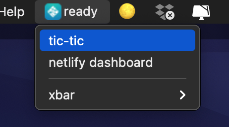
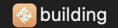
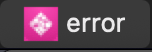
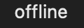
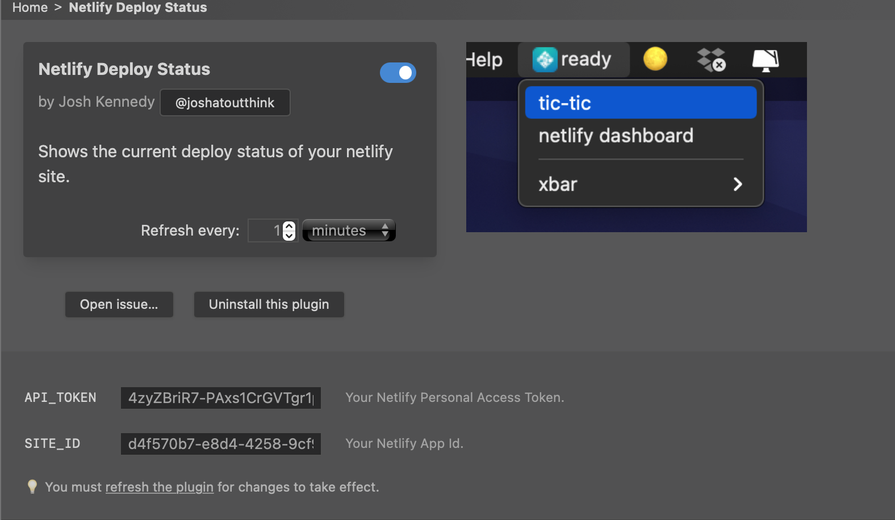

# Netlify Site Deploy Status Menu Bar Icon

Check your Netlify Site Deploy status right in your Mac menu bar.

This is a [xbar](https://xbarapp.com/) plugin, that displays the current deploy status of your netlify site. 

If the site is Deployed you will see 

If the site is Building you will see 

If the site is Building you will see 

If the plugin can't connect to the api you will see 

## Install

1. First install [xbar](https://xbarapp.com/dl), if you haven't already.
2. Install Plugin called `Netlify Deploy Status`.

## Setup and Configure

This plugin requires a [Personal Access Token](https://app.netlify.com/user/applications?_ga=2.170657952.1601832669.1626982353-514414476.1602856697#personal-access-tokens) for authentication, and your app id of the site you want in your menu bar.
Enter these credentials in the plugin options.

### Setup Plugin

#### Getting Personal Access Token

You can generate an access token manually in your Netlify user settings for [Personal access tokens](https://app.netlify.com/user/applications?_ga=2.170657952.1601832669.1626982353-514414476.1602856697#personal-access-tokens).

1. Under Personal access tokens, select New access token.

1. Enter a description.

1. Select Generate token.

1. Copy the generated token to your clipboard. Once you navigate from the page, the token cannot be seen again.

*this is from the [netlify docs](https://docs.netlify.com/cli/get-started/#obtain-a-token-in-the-netlify-ui)*

#### Getting App Id / Site Id

1. Login in to the [Netlify Dashboard](app.netlify.com/sites/) and navigate to the specific site you wish to be in your menu bar
1. Go to the Sites General Settings.
1. Underneath Site Information you will see `App Id`, copy that and paste that into the plugin settings.

### Configure Refresh Rate.

By default the plugin will refresh once per minute. You can change this in the plugin options to be more or less frequent. I find that once per minute is accurate enough, but if more accuracy is desired reduce the refresh time.

